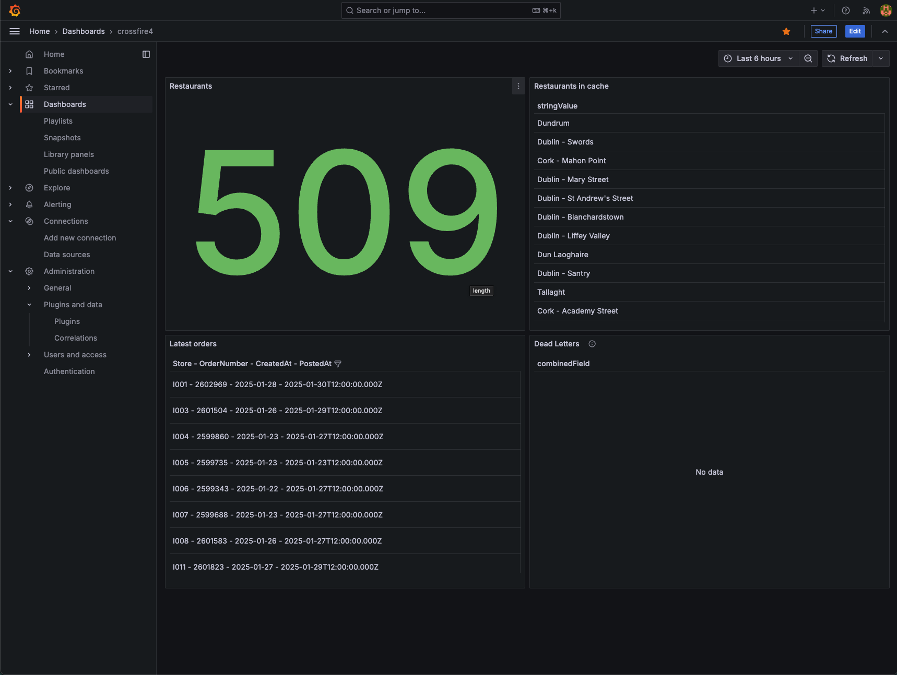
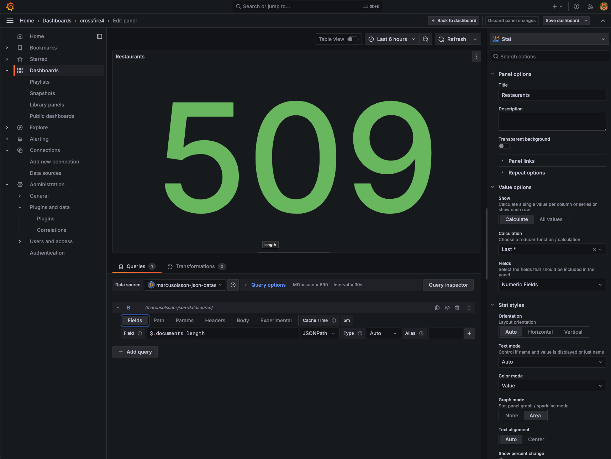
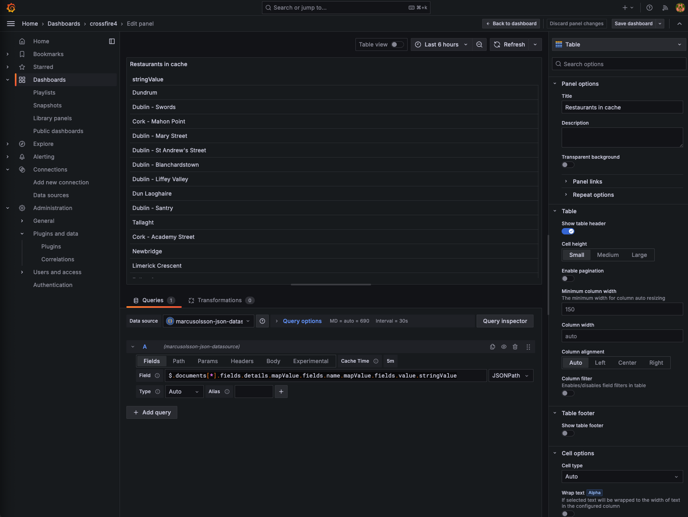
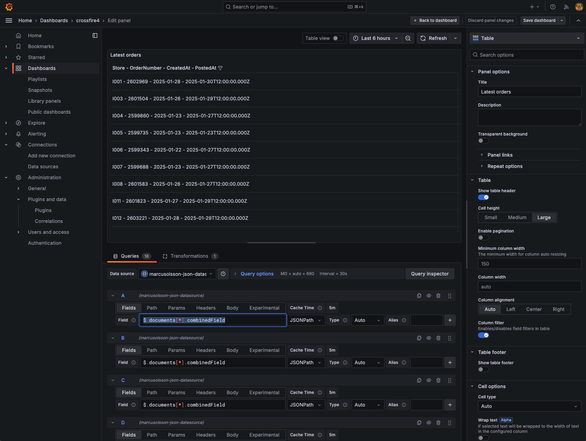
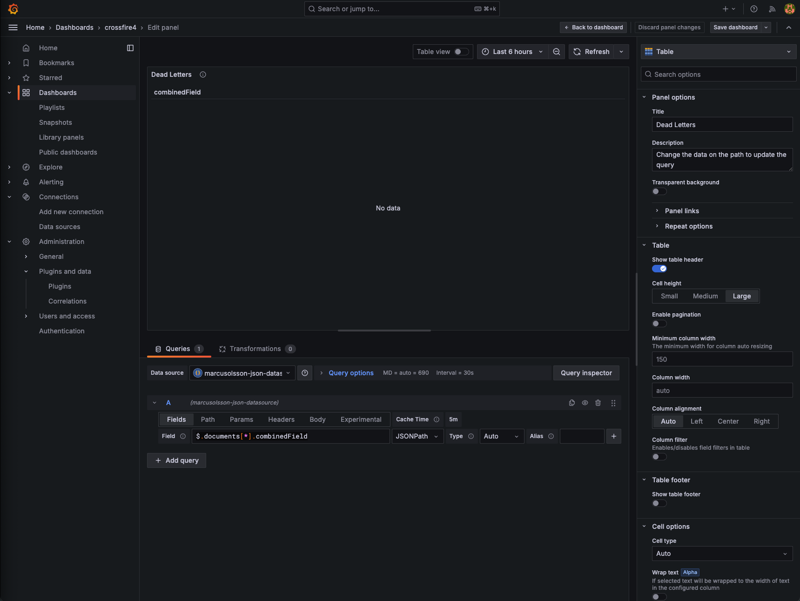

# Crossfire Grafana Go

A Go-based project designed to fetch and process data from Firestore for integration with Grafana dashboards using the Firestore REST API.

---

## Features
- Fetches data from Firestore collections (e.g., `restaurants`, `latest-orders`, `dead-letters`).
- Handles Firestore API pagination to retrieve all restaurants

---

## Prerequisites
1. **Go**: Install [Go](https://golang.org/doc/install) (version 1.23.5 or higher).
2. **Google Cloud SDK**: Set up [Google Cloud SDK](https://cloud.google.com/sdk/docs/install) to authenticate and manage your credentials.
3. **Firestore REST API**: Ensure the Firestore REST API is enabled for your Google Cloud project.
4. **Access Permissions**: Ensure your user or service account has the `Firestore User` role to access Firestore data.

---

## Installation

1. Clone the repository:
   ```bash
   git clone https://github.com/Julian0816/crossfire-grafana-go.git
   cd crossfire-grafana-go

2. Install dependencies:
   ```bash
   go mod tidy

3. Set up environment variables:
   ```bash
   PROJECT_ID=your-google-cloud-project-id
   DATABASE_ID=crossfire-edi-id

---

## Usage

1. Run the Server: Start the server locally:
   ```bash
   go run main.go
The server will run on http://localhost:4000

2. Available Endpoints
- Base Endpoint:
   ```bash
   GET /
Response: {"message": "Server is running"}

- Fetch Restaurants:
   ```bash
   GET /restaurants-cache

- Fetch Latest Orders:
   ```bash
   GET /latest-orders?subCollection=<SUB_COLLECTION_ID>

- Fetch Dead Letters:
   ```bash
   GET /dead-letters-specific?subCollection=<SUB_COLLECTION_ID>

---

## Folder Structure

   ```bash
   .
├── internal/
│   ├── handlers/          # Request handlers
│   ├── routes/            # Route definitions
│   └── services/          # Business logic (Firestore queries)
├── main.go                # Entry point of the application
├── .env                   # Environment variables (ignored by Git)
├── .gitignore             # Git ignore rules
└── go.mod                 # Go module dependencies
  ```

## Grafana Dashboard


## Grafana Paths and Fields set up

### Restaurants Legth
```bash
   GET /restaurants-cache
   FIELD $.documents.length
```


### Restaurants in cache
```bash
   GET /restaurants-cache
   FIELDS $.documents[*].fields.details.mapValue.fields.name.mapValue.fields.value.stringValue
```


### Latest Orders
```bash
   GET /latest-orders?subCollection=I001
   FIELDS $.$.documents[*].combinedField
```


### Dead Letters
```bash
   GET /dead-letters-specific?subCollection=2025-01-29
   FIELDS $.documents[*].combinedField
```
